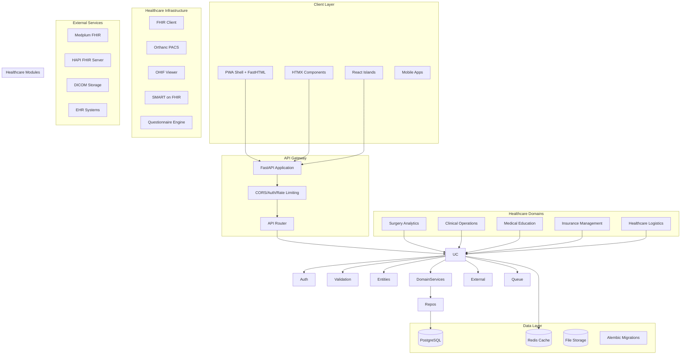
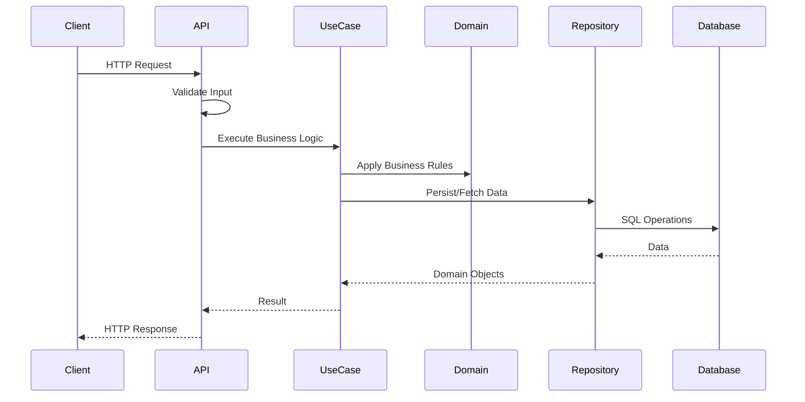
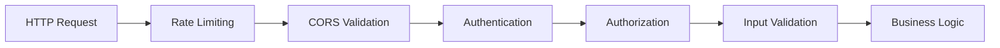
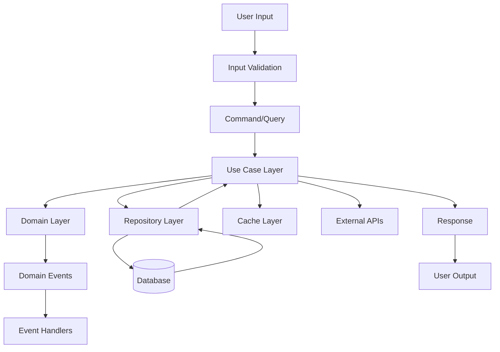
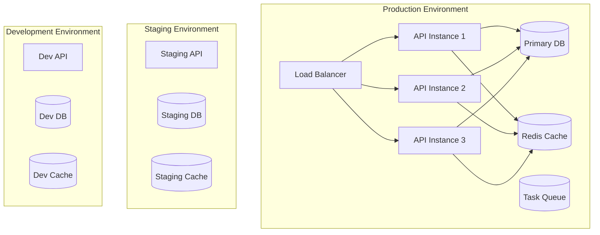
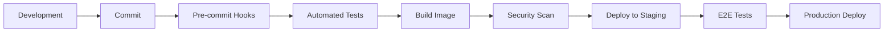

# YAZ Platform - Lean Architecture Overview

## System Structure

YAZ Platform follows a **lean, modular architecture** with clear separation of concerns and minimal overhead.

### Directory Structure

```
/workspaces/yaz/
├── apps/                    # Application modules
│   ├── core/               # Core platform services
│   │   ├── app.py         # FastAPI app builder
│   │   ├── routers/       # API routers (FHIR, forms, etc.)
│   │   ├── static/        # Static assets
│   │   └── templates/     # HTML templates
│   ├── surge/             # Surgery analytics
│   ├── move/              # Medical logistics
│   ├── clinica/           # Clinical operations
│   ├── educa/             # Medical education
│   ├── insura/            # Insurance management
│   └── registry.py        # App registration system
├── config/                # All configuration files
│   ├── alembic.ini       # Database migrations
│   ├── ruff.toml         # Code formatting
│   └── *.yaml            # Other configs
├── data/                  # Data storage
│   ├── logs/             # Application logs
│   ├── uploads/          # File uploads
│   └── *.db              # Databases
├── docs/                  # Documentation
├── infra/                 # Infrastructure utilities
│   ├── monitoring/       # System monitoring
│   ├── encryption.py     # Network security
│   └── *_client.py       # External integrations
├── scripts/               # Operational scripts
├── tests/                 # Test suites
├── main.py               # Platform entry point
├── unified_platform.py   # Unified platform logic
└── pyproject.toml        # Python project config
```

### Request Flow



## Module Dependencies

### Core Modules
- **Domain**: Pure business logic, no external dependencies
- **Application**: Orchestrates domain and infrastructure
- **Infrastructure**: External system adapters (DB, APIs, cache)
- **API**: HTTP interface layer
- **Client**: User interface components

### Healthcare Applications
Each healthcare module follows clean architecture:
- **Entities**: Core business objects
- **Use Cases**: Application-specific business rules
- **Adapters**: Interface implementations
- **Controllers**: HTTP/UI controllers

## Request Flow



## Technology Stack

### Backend
- **FastAPI**: Modern, fast web framework
- **SQLAlchemy**: ORM with database abstraction
- **Alembic**: Database migrations
- **Pydantic**: Data validation and serialization
- **Redis**: Caching and session storage

### Frontend
- **FastHTML**: Server-side rendered HTML
- **HTMX**: Dynamic HTML over the wire
- **React**: Islands architecture for complex interactions
- **PWA**: Progressive Web App capabilities

### Database
- **PostgreSQL/CockroachDB**: Primary database
- **SQLite**: Development and testing

### DevOps
- **Podman**: Containerization
- **GitHub Actions**: CI/CD
- **Pre-commit**: Code quality hooks

## Security Architecture



## Data Flow Architecture



## Deployment Architecture



## Performance Considerations

### Caching Strategy
- **Application Level**: Redis for session data and frequently accessed objects
- **Database Level**: Query result caching
- **CDN Level**: Static asset caching

### Scalability
- **Horizontal Scaling**: Multiple API instances behind load balancer
- **Database Scaling**: Read replicas for read-heavy operations
- **Async Processing**: Background tasks for heavy operations

### Monitoring
- **Health Checks**: Application and dependency health endpoints
- **Metrics**: Performance metrics collection
- **Logging**: Structured logging with correlation IDs
- **Tracing**: Request tracing for debugging

## Security Measures

### Authentication & Authorization
- JWT tokens for API authentication
- Role-based access control (RBAC)
- Session management

### Data Protection
- Input validation and sanitization
- SQL injection prevention through ORM
- XSS protection
- CSRF protection for forms

### Infrastructure Security
- Container security scanning
- Dependency vulnerability scanning
- Secret management
- Network security (TLS, firewall rules)

## Development Workflow



## Quality Gates

### Code Quality
- Type checking with mypy
- Linting with ruff/flake8
- Code formatting with black
- Import sorting with isort

### Security
- Static code analysis with bandit
- Container scanning with trivy
- Dependency scanning with pip-audit
- Secret scanning with gitleaks

### Testing
- Unit tests (>80% coverage)
- Integration tests
- E2E tests
- Performance tests

## Migration Strategy

### Phase 1: Safety Net
- Add comprehensive testing
- Set up CI/CD pipeline
- Add monitoring and logging

### Phase 2: Clean Architecture
- Refactor to layered architecture
- Extract domain logic
- Implement repository pattern

### Phase 3: Performance & Scale
- Add caching layer
- Optimize database queries
- Implement background processing

### Phase 4: Advanced Features
- Add PWA capabilities
- Implement real-time features
- Add advanced monitoring

## Key Architectural Decisions

### ADR-001: Clean Architecture
**Decision**: Adopt clean architecture with clear separation of concerns
**Rationale**: Maintainability, testability, and independence from frameworks
**Consequences**: More complex initially but better long-term maintainability

### ADR-002: FastAPI + FastHTML
**Decision**: Use FastAPI for APIs and FastHTML for server-side rendering
**Rationale**: Type safety, performance, and modern Python ecosystem
**Consequences**: Learning curve but better developer experience

### ADR-003: Repository Pattern
**Decision**: Implement repository pattern for data access
**Rationale**: Database independence and easier testing
**Consequences**: Additional abstraction layer but improved testability

### ADR-004: Event-Driven Architecture
**Decision**: Use domain events for cross-cutting concerns
**Rationale**: Loose coupling and extensibility
**Consequences**: More complex event handling but better modularity
