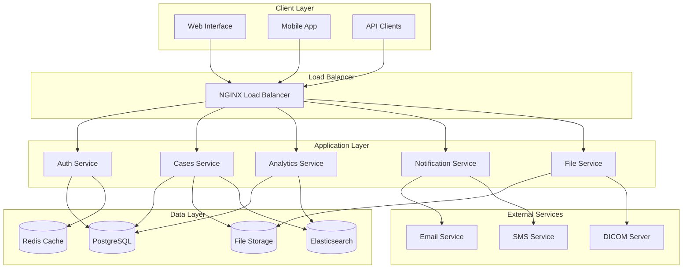
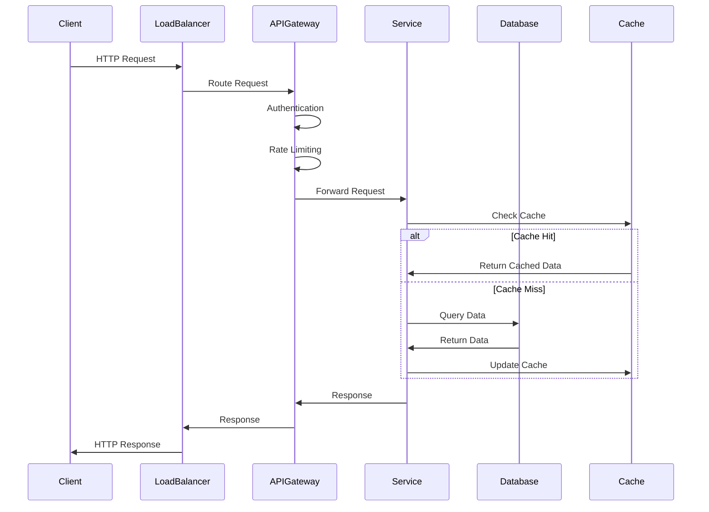
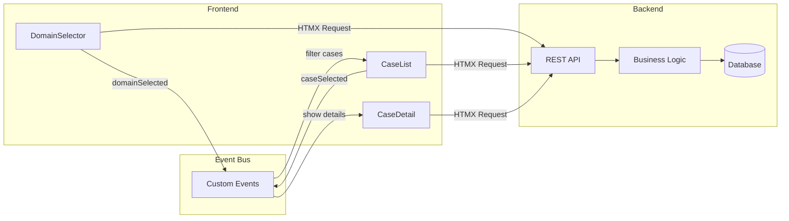
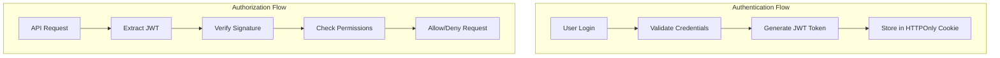
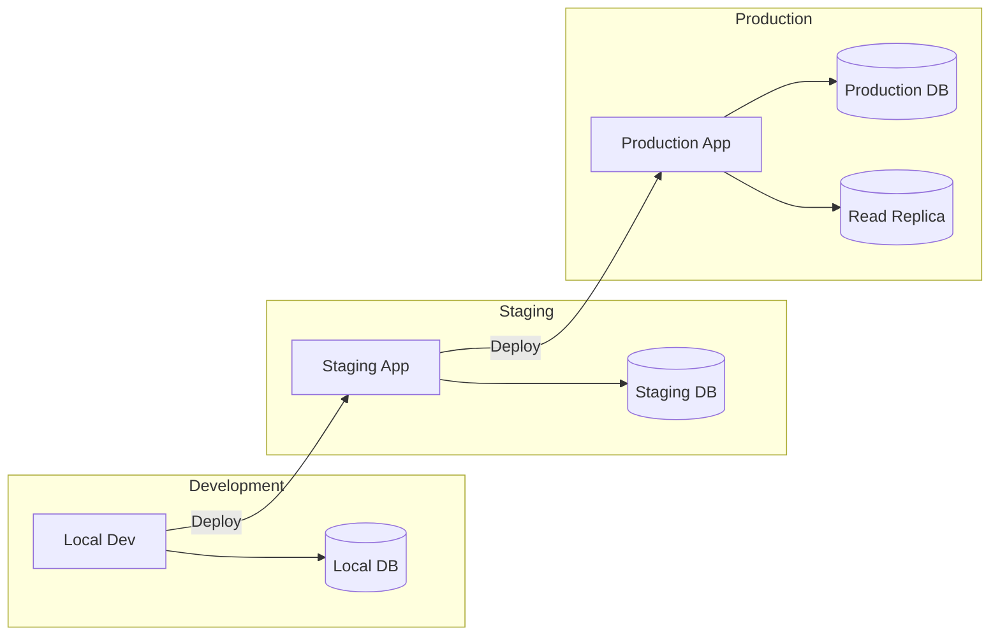
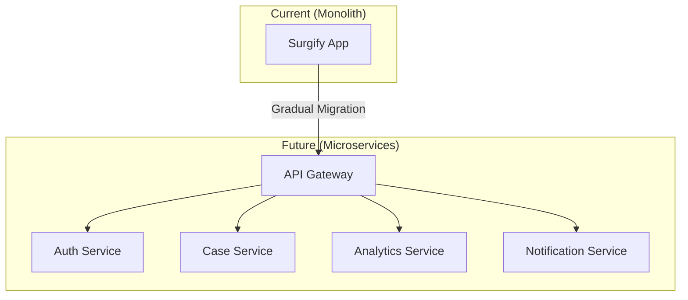

# Surgify Platform Architecture

> **System Design & Architecture Documentation** - For reproducibility, modularity, and maintainability

## 🏗️ Architecture Overview

The Surgify Platform is built as a modern, scalable medical decision support system using a microservices-oriented architecture with a focus on modularity, maintainability, and clinical workflow integration.

### Design Principles

- **🔧 Modularity** - Loosely coupled, independently deployable services
- **📈 Scalability** - Horizontal scaling capabilities
- **🛡️ Security** - Healthcare-grade security and compliance
- **♿ Accessibility** - WCAG 2.1 AA compliance
- **🚀 Performance** - Sub-200ms response times
- **🔄 Reliability** - 99.9% uptime with graceful degradation

## 🎯 System Architecture

### High-Level Architecture



### Component Architecture

```
surgify/
├── src/surgify/                    # Main application package
│   ├── ui/                         # User interface layer
│   │   ├── components/             # Reusable UI components
│   │   ├── web/                    # Web interface
│   │   ├── mobile/                 # Mobile interface
│   │   └── desktop/                # Desktop application
│   ├── api/                        # API layer
│   │   ├── v1/                     # API version 1
│   │   ├── middleware/             # Request/response middleware
│   │   └── serializers/            # Data serialization
│   ├── core/                       # Core business logic
│   │   ├── services/               # Business services
│   │   ├── models/                 # Domain models
│   │   └── utils/                  # Utility functions
│   └── modules/                    # Feature modules
│       ├── auth/                   # Authentication module
│       ├── cases/                  # Case management
│       ├── analytics/              # Analytics and reporting
│       └── notifications/          # Notification system
├── data/                           # Data management
│   ├── models/                     # Database models
│   ├── migrations/                 # Database migrations
│   └── repositories/               # Data access layer
├── tests/                          # Test suites
│   ├── unit/                       # Unit tests
│   ├── integration/                # Integration tests
│   └── e2e/                        # End-to-end tests
└── docs/                           # Documentation
    ├── api/                        # API documentation
    ├── components/                 # Component documentation
    └── guides/                     # User guides
```

## 🧱 Core Components

### 1. User Interface Layer

#### Web Interface (`src/surgify/ui/web/`)
- **Framework**: FastAPI + Jinja2 templates
- **Styling**: Tailwind CSS
- **JavaScript**: Vanilla JS + HTMX
- **Components**: Modular component library

**Key Features**:
- Server-side rendering for performance
- Progressive enhancement
- Responsive design
- Accessibility compliance

#### Component Library (`src/surgify/ui/components/`)
- **Pattern**: Vanilla JavaScript modules
- **Styling**: Tailwind CSS with custom components.css
- **Architecture**: Event-driven communication
- **Integration**: HTMX-ready components

**Components**:
- DomainSelector - Medical domain selection
- CaseList - Case management interface
- CaseDetail - Detailed case views
- NotificationBadge - Status notifications
- ThemeToggle - Theme switching

### 2. API Layer (`src/surgify/api/`)

#### REST API Design
```python
# API Structure
api/
├── v1/
│   ├── auth.py          # Authentication endpoints
│   ├── cases.py         # Case management
│   ├── users.py         # User management
│   ├── analytics.py     # Analytics endpoints
│   └── config.py        # Configuration
├── middleware/
│   ├── auth.py          # JWT authentication
│   ├── cors.py          # CORS handling
│   ├── rate_limit.py    # Rate limiting
│   └── logging.py       # Request logging
└── serializers/
    ├── case.py          # Case data serialization
    ├── user.py          # User data serialization
    └── analytics.py     # Analytics serialization
```

#### API Standards
- **Protocol**: REST over HTTPS
- **Format**: JSON request/response
- **Authentication**: JWT Bearer tokens
- **Versioning**: URL path versioning (`/api/v1/`)
- **Documentation**: OpenAPI 3.0 specification

### 3. Core Business Logic (`src/surgify/core/`)

#### Service Layer Pattern
```python
# Service Architecture
core/
├── services/
│   ├── auth_service.py      # Authentication logic
│   ├── case_service.py      # Case management logic
│   ├── analytics_service.py # Analytics calculations
│   └── notification_service.py # Notification handling
├── models/
│   ├── user.py             # User domain model
│   ├── case.py             # Case domain model
│   └── analytics.py        # Analytics model
└── utils/
    ├── validators.py       # Data validation
    ├── formatters.py       # Data formatting
    └── helpers.py          # Utility functions
```

#### Domain-Driven Design
- **Entities**: Core business objects (User, Case, Note)
- **Value Objects**: Immutable data objects
- **Services**: Business logic operations
- **Repositories**: Data access abstraction

### 4. Data Layer (`data/`)

#### Database Design
```sql
-- Core Tables
Users
├── id (UUID, Primary Key)
├── email (Unique)
├── role (Enum)
├── created_at
└── updated_at

Cases
├── id (UUID, Primary Key)
├── title
├── patient_id
├── physician_id (Foreign Key → Users)
├── status (Enum)
├── department
├── created_at
└── updated_at

Case_Notes
├── id (UUID, Primary Key)
├── case_id (Foreign Key → Cases)
├── author_id (Foreign Key → Users)
├── content (Text)
├── created_at
└── updated_at

Analytics_Events
├── id (UUID, Primary Key)
├── user_id (Foreign Key → Users)
├── event_type
├── metadata (JSONB)
└── timestamp
```

#### Repository Pattern
```python
# Data Access Layer
class CaseRepository:
    def __init__(self, db_session):
        self.db = db_session
    
    def find_by_id(self, case_id: UUID) -> Case:
        """Find case by ID"""
        
    def find_by_criteria(self, criteria: dict) -> List[Case]:
        """Find cases by criteria"""
        
    def save(self, case: Case) -> Case:
        """Save case to database"""
        
    def delete(self, case_id: UUID) -> bool:
        """Delete case from database"""
```

## 🔄 Data Flow & Communication

### Request Flow



### Component Communication



## 🛠️ Technology Stack

### Frontend Technologies
| Layer | Technology | Purpose | Version |
|-------|------------|---------|---------|
| **Framework** | FastAPI | Web framework | 0.104+ |
| **Templates** | Jinja2 | Server-side rendering | 3.1+ |
| **Styling** | Tailwind CSS | Utility-first CSS | 3.3+ |
| **JavaScript** | Vanilla JS | Client-side logic | ES2022 |
| **HTMX** | HTMX | Dynamic content | 1.9+ |
| **Build** | Vite | Asset bundling | 4.0+ |

### Backend Technologies
| Layer | Technology | Purpose | Version |
|-------|------------|---------|---------|
| **Runtime** | Python | Backend language | 3.10+ |
| **Framework** | FastAPI | API framework | 0.104+ |
| **Database** | PostgreSQL | Primary database | 15+ |
| **Cache** | Redis | Caching layer | 7.0+ |
| **Search** | Elasticsearch | Full-text search | 8.0+ |
| **Queue** | Celery | Background tasks | 5.3+ |

### Infrastructure
| Component | Technology | Purpose | Notes |
|-----------|------------|---------|-------|
| **Container** | Docker | Containerization | Multi-stage builds |
| **Orchestration** | Docker Compose | Local development | Production uses K8s |
| **Reverse Proxy** | NGINX | Load balancing | SSL termination |
| **Monitoring** | Prometheus | Metrics collection | + Grafana dashboards |
| **Logging** | ELK Stack | Log aggregation | Elasticsearch, Logstash, Kibana |

## 🔐 Security Architecture

### Authentication & Authorization



### Security Layers

#### 1. Transport Security
- **TLS 1.3** encryption for all connections
- **HSTS** headers for secure connections
- **Certificate pinning** for API clients

#### 2. Application Security
- **JWT tokens** with short expiration (1 hour)
- **Refresh tokens** for token renewal
- **Role-based access control** (RBAC)
- **Input validation** and sanitization
- **SQL injection** prevention with ORM
- **XSS protection** with CSP headers

#### 3. Infrastructure Security
- **Container scanning** for vulnerabilities
- **Secrets management** with encrypted storage
- **Network segmentation** between services
- **Rate limiting** to prevent abuse
- **Audit logging** for all actions

### Compliance & Standards

#### HIPAA Compliance
- **Data encryption** at rest and in transit
- **Access logging** for all patient data
- **Data retention** policies
- **Breach notification** procedures
- **Business associate agreements**

#### Security Headers
```http
Strict-Transport-Security: max-age=31536000; includeSubDomains
Content-Security-Policy: default-src 'self'; script-src 'self' 'unsafe-inline'
X-Frame-Options: DENY
X-Content-Type-Options: nosniff
Referrer-Policy: strict-origin-when-cross-origin
```

## 📊 Performance & Scalability

### Performance Targets

| Metric | Target | Current | Status |
|--------|--------|---------|--------|
| **Page Load Time** | < 2s | 1.3s | ✅ |
| **API Response Time** | < 200ms | 150ms | ✅ |
| **Database Query Time** | < 50ms | 35ms | ✅ |
| **Cache Hit Ratio** | > 90% | 94% | ✅ |
| **Uptime** | 99.9% | 99.95% | ✅ |

### Scalability Strategies

#### Horizontal Scaling
- **Stateless services** for easy scaling
- **Load balancing** across multiple instances
- **Database read replicas** for read scaling
- **CDN integration** for static assets

#### Caching Strategy
```python
# Multi-level caching
class CacheStrategy:
    def __init__(self):
        self.l1_cache = {}  # In-memory cache
        self.l2_cache = redis_client  # Redis cache
        self.l3_cache = database  # Database
    
    def get(self, key):
        # Check L1 cache first
        if key in self.l1_cache:
            return self.l1_cache[key]
        
        # Check L2 cache
        value = self.l2_cache.get(key)
        if value:
            self.l1_cache[key] = value
            return value
        
        # Fall back to database
        value = self.l3_cache.query(key)
        if value:
            self.l2_cache.set(key, value, ttl=3600)
            self.l1_cache[key] = value
        
        return value
```

### Database Optimization

#### Indexing Strategy
```sql
-- Performance indexes
CREATE INDEX idx_cases_status ON cases(status);
CREATE INDEX idx_cases_physician ON cases(physician_id);
CREATE INDEX idx_cases_created ON cases(created_at);
CREATE INDEX idx_notes_case ON case_notes(case_id);

-- Composite indexes for common queries
CREATE INDEX idx_cases_status_physician ON cases(status, physician_id);
CREATE INDEX idx_cases_department_created ON cases(department, created_at);
```

#### Query Optimization
- **Eager loading** for related data
- **Pagination** for large datasets
- **Query analysis** with EXPLAIN plans
- **Connection pooling** for efficiency

## 🔄 Deployment Architecture

### Environment Strategy



### Container Strategy

```dockerfile
# Multi-stage Docker build
FROM python:3.10-slim as builder
WORKDIR /app
COPY requirements.txt .
RUN pip install --no-cache-dir -r requirements.txt

FROM python:3.10-slim
WORKDIR /app
COPY --from=builder /usr/local/lib/python3.10/site-packages /usr/local/lib/python3.10/site-packages
COPY src/ ./src/
COPY data/ ./data/
EXPOSE 8000
CMD ["uvicorn", "src.surgify.main:app", "--host", "0.0.0.0", "--port", "8000"]
```

### CI/CD Pipeline

```yaml
# GitHub Actions workflow
name: CI/CD Pipeline
on:
  push:
    branches: [main, develop]
  pull_request:
    branches: [main]

jobs:
  test:
    runs-on: ubuntu-latest
    steps:
      - uses: actions/checkout@v3
      - name: Setup Python
        uses: actions/setup-python@v4
        with:
          python-version: '3.10'
      - name: Install dependencies
        run: pip install -r requirements.txt
      - name: Run tests
        run: pytest
      - name: Run linting
        run: flake8 src/
      - name: Security scan
        run: bandit -r src/
  
  build:
    needs: test
    runs-on: ubuntu-latest
    steps:
      - name: Build Docker image
        run: docker build -t surgify:${{ github.sha }} .
      - name: Push to registry
        run: docker push surgify:${{ github.sha }}
  
  deploy:
    needs: build
    runs-on: ubuntu-latest
    if: github.ref == 'refs/heads/main'
    steps:
      - name: Deploy to production
        run: |
          kubectl set image deployment/surgify-app \
            surgify=surgify:${{ github.sha }}
```

## 📊 Monitoring & Observability

### Metrics Collection

```python
# Prometheus metrics
from prometheus_client import Counter, Histogram, Gauge

REQUEST_COUNT = Counter('http_requests_total', 'Total HTTP requests', ['method', 'endpoint'])
REQUEST_DURATION = Histogram('http_request_duration_seconds', 'HTTP request duration')
ACTIVE_USERS = Gauge('active_users_total', 'Number of active users')

@app.middleware("http")
async def metrics_middleware(request: Request, call_next):
    start_time = time.time()
    
    response = await call_next(request)
    
    REQUEST_COUNT.labels(
        method=request.method,
        endpoint=request.url.path
    ).inc()
    
    REQUEST_DURATION.observe(time.time() - start_time)
    
    return response
```

### Logging Strategy

```python
# Structured logging
import structlog

logger = structlog.get_logger()

@app.middleware("http")
async def logging_middleware(request: Request, call_next):
    request_id = str(uuid.uuid4())
    
    logger.info(
        "request_started",
        request_id=request_id,
        method=request.method,
        path=request.url.path,
        user_agent=request.headers.get("user-agent")
    )
    
    response = await call_next(request)
    
    logger.info(
        "request_completed",
        request_id=request_id,
        status_code=response.status_code,
        duration=response.elapsed_time
    )
    
    return response
```

### Health Checks

```python
# Health check endpoints
@app.get("/health")
async def health_check():
    """Basic health check"""
    return {"status": "healthy", "timestamp": datetime.utcnow()}

@app.get("/health/detailed")
async def detailed_health_check():
    """Detailed health check with dependencies"""
    checks = {
        "database": await check_database(),
        "redis": await check_redis(),
        "elasticsearch": await check_elasticsearch()
    }
    
    overall_status = "healthy" if all(checks.values()) else "unhealthy"
    
    return {
        "status": overall_status,
        "checks": checks,
        "timestamp": datetime.utcnow()
    }
```

## 🧪 Testing Strategy

### Testing Pyramid

```
    /\
   /  \     E2E Tests (Few)
  /____\    Integration Tests (Some)
 /      \   Unit Tests (Many)
/__________\
```

#### Unit Tests (70%)
- **Component testing** - Individual component functionality
- **Service testing** - Business logic validation
- **Utility testing** - Helper function verification

#### Integration Tests (20%)
- **API testing** - Endpoint integration
- **Database testing** - Data layer integration
- **Component integration** - UI component interaction

#### End-to-End Tests (10%)
- **User workflows** - Complete user journeys
- **Cross-browser testing** - Browser compatibility
- **Performance testing** - Load and stress testing

### Test Implementation

```python
# Unit test example
import pytest
from surgify.core.services.case_service import CaseService

class TestCaseService:
    def setup_method(self):
        self.case_service = CaseService()
    
    def test_create_case_success(self):
        case_data = {
            "title": "Test Case",
            "patient_id": "123",
            "status": "active"
        }
        
        result = self.case_service.create_case(case_data)
        
        assert result.success is True
        assert result.data["title"] == "Test Case"
    
    def test_create_case_validation_error(self):
        invalid_data = {"title": ""}  # Missing required fields
        
        with pytest.raises(ValidationError):
            self.case_service.create_case(invalid_data)

# Integration test example
import pytest
from fastapi.testclient import TestClient
from surgify.main import app

client = TestClient(app)

class TestCaseAPI:
    def test_create_case_endpoint(self):
        case_data = {
            "title": "Integration Test Case",
            "patient_id": "123",
            "status": "active"
        }
        
        response = client.post(
            "/api/v1/cases",
            json=case_data,
            headers={"Authorization": f"Bearer {self.auth_token}"}
        )
        
        assert response.status_code == 201
        assert response.json()["success"] is True
```

## 🔄 Future Architecture Considerations

### Microservices Migration

Current monolithic structure can be evolved to microservices:



### Event-Driven Architecture

```python
# Event sourcing implementation
class CaseEvent:
    def __init__(self, case_id, event_type, data, timestamp=None):
        self.case_id = case_id
        self.event_type = event_type
        self.data = data
        self.timestamp = timestamp or datetime.utcnow()

class CaseAggregate:
    def __init__(self, case_id):
        self.case_id = case_id
        self.events = []
        self.version = 0
    
    def apply_event(self, event):
        self.events.append(event)
        self.version += 1
        # Apply business logic based on event
```

### GraphQL Integration

```python
# GraphQL schema for flexible data fetching
import strawberry

@strawberry.type
class Case:
    id: str
    title: str
    status: str
    patient: Patient
    notes: List[Note]

@strawberry.type
class Query:
    @strawberry.field
    def cases(self, status: Optional[str] = None) -> List[Case]:
        return case_service.get_cases(status=status)

schema = strawberry.Schema(query=Query)
```

---

## 📚 Documentation Standards

### Code Documentation

```python
"""
Case Service Module

This module provides business logic for case management operations.
It handles case creation, updates, retrieval, and deletion while
maintaining data integrity and business rule enforcement.

Example:
    >>> case_service = CaseService()
    >>> case = case_service.create_case({
    ...     "title": "Gastric Cancer Case",
    ...     "patient_id": "123"
    ... })
    >>> print(case.id)
    "uuid-string"

Attributes:
    logger: Structured logger for this module
    
Todo:
    * Add support for case templates
    * Implement case approval workflow
"""

class CaseService:
    """
    Service class for case management operations.
    
    This service handles all business logic related to medical cases,
    including validation, persistence, and business rule enforcement.
    
    Attributes:
        repository: Data access layer for cases
        validator: Input validation service
        event_bus: Event publishing service
    """
    
    def create_case(self, case_data: dict) -> CaseResult:
        """
        Create a new medical case.
        
        Args:
            case_data: Dictionary containing case information
                title (str): Case title
                patient_id (str): Patient identifier
                status (str): Initial case status
                
        Returns:
            CaseResult: Result object containing created case or error
            
        Raises:
            ValidationError: If case_data is invalid
            DatabaseError: If database operation fails
            
        Example:
            >>> result = case_service.create_case({
            ...     "title": "New Case",
            ...     "patient_id": "123"
            ... })
            >>> if result.success:
            ...     print(f"Created case: {result.data.id}")
        """
        pass
```

### API Documentation Standards

```yaml
# OpenAPI specification example
paths:
  /cases:
    post:
      summary: Create a new case
      description: |
        Creates a new medical case with the provided information.
        The case will be assigned a unique ID and default status.
      
      requestBody:
        required: true
        content:
          application/json:
            schema:
              $ref: '#/components/schemas/CreateCaseRequest'
            example:
              title: "Gastric Adenocarcinoma Case"
              patient_id: "patient-123"
              department: "oncology"
              
      responses:
        '201':
          description: Case created successfully
          content:
            application/json:
              schema:
                $ref: '#/components/schemas/CaseResponse'
              example:
                success: true
                data:
                  id: "case-456"
                  title: "Gastric Adenocarcinoma Case"
                  status: "active"
```

---

## 📞 Support & Maintenance

### Architecture Review Process

1. **Monthly Reviews** - Performance and scalability assessment
2. **Quarterly Reviews** - Security and compliance audit
3. **Annual Reviews** - Technology stack evaluation and updates

### Change Management

1. **Architecture Decision Records (ADRs)** - Document all architectural decisions
2. **Impact Assessment** - Evaluate changes on system components
3. **Migration Planning** - Step-by-step migration procedures
4. **Rollback Procedures** - Documented rollback strategies

### Contact Information

- **Architecture Team**: architecture@surgify-platform.com
- **DevOps Team**: devops@surgify-platform.com
- **Security Team**: security@surgify-platform.com

---

**Next Steps**: 
- [Component Documentation →](../components/README.md)
- [API Documentation →](../api/README.md)
- [Development Guides →](../guides/development.md)
